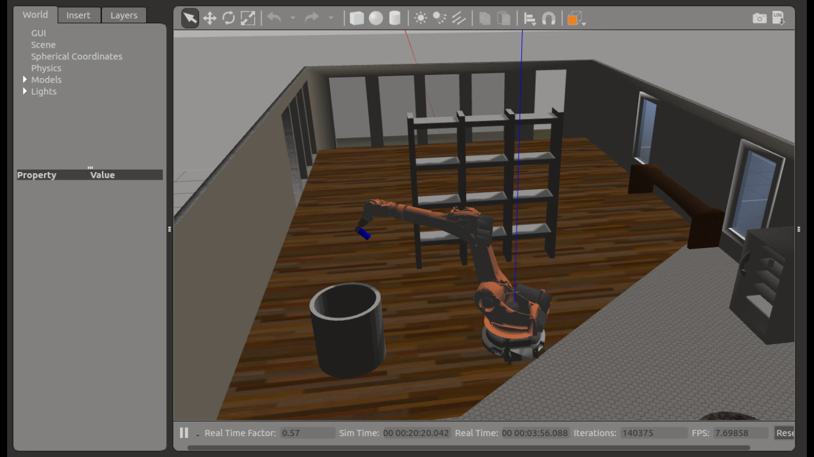

## Project: Kinematics Pick & Place
---

**Steps to complete the project:**  

1. Set up the ROS Workspace.
2. Download or clone the [project repository](https://github.com/udacity/RoboND-Kinematics-Project) into the ***src*** directory of the ROS Workspace.  
3. Experiment with the forward_kinematics environment and get familiar with the robot.
4. Launch in [demo mode](https://classroom.udacity.com/nanodegrees/nd209/parts/7b2fd2d7-e181-401e-977a-6158c77bf816/modules/8855de3f-2897-46c3-a805-628b5ecf045b/lessons/91d017b1-4493-4522-ad52-04a74a01094c/concepts/ae64bb91-e8c4-44c9-adbe-798e8f688193).
5. Perform Kinematic Analysis for the robot following the [project rubric](https://review.udacity.com/#!/rubrics/972/view).
6. Fill in the `IK_server.py` with your Inverse Kinematics code. 

More on setting up and running the project is available [here](Project_Setup.bd).
[//]: # (Image References)

[image1]: ./misc_images/misc1.png
[image2]: ./misc_images/misc3.png
[image3]: ./misc_images/misc2.png
[robot_DH]: ./misc_images/robot_DH.jpg
[theta1]: ./misc_images/theta1.jpg
[theta2]: ./misc_images/theta2.jpg
[theta3]: ./misc_images/theta3.jpg
[end_fig]: ./misc_images/end.png

## [Rubric](https://review.udacity.com/#!/rubrics/972/view) Points
### Here I will consider the rubric points individually and describe how I addressed each point in my implementation.  

---
### Writeup / README

#### 1. Provide a Writeup / README that includes all the rubric points and how you addressed each one.

[This](README.md) is the writeup for this project.

### Kinematic Analysis
#### 1. Run the forward_kinematics demo and evaluate the kr210.urdf.xacro file to perform kinematic analysis of Kuka KR210 robot and derive its DH parameters.

The pick and place simulator was ran in demo mode to analyze the kinematics of the Kuka KR210 robot. Steps to run this is available in [this](Project_Setup.md) file.

The `kr210.urdf.xacro` is the URDF(Unified Robot Description Format) file that contains the robot model. The below image shows the robot.

![alt text][image1]

For performing the kinematic analysis of the robot, the `joint` tag has to be examined. The following is the joint tag from base_link(parent) to link 1(child).
```xml
<joint name="joint_1" type="revolute">
    <origin xyz="0 0 0.33" rpy="0 0 0"/>
    <parent link="base_link"/>
    <child link="link_1"/>
    <axis xyz="0 0 1"/>
    <limit lower="${-185*deg}" upper="${185*deg}" effort="300" velocity="${123*deg}"/>
  </joint>
```
The origin sub-tag provides information about the relative position of the child with respect to the parent link. 

The relative position of joints extracted from the urdf file is summarized in the below table.

Joint Name | Parent link | Child link | x(m) | y(m) | z(m) | roll | pitch | yaw
--- | --- | --- | --- | --- | --- | --- | --- | ---
joint_1 | base_link | link_1 | 0 | 0 | 0.33 | 0 | 0 | 0
joint_2 | link_1 | link_2 | 0.35 | 0 | 0.42 | 0 | 0 | 0
joint_3 | link_2 | link_3 | 0 | 0 | 1.25 | 0 | 0 | 0
joint_4 | link_3 | link_4 | 0.96 | 0 | -0.054 | 0 | 0 | 0
joint_5 | link_4 | link_5 | 0.54 | 0 | 0 | 0 | 0 | 0
joint_6 | link_5 | link_6 | 0.193 | 0 | 0 | 0 | 0 | 0
gripper_joint | link_6 | gripper_link | 0.11 | 0 | 0 | 0 | 0 | 0

The following figure shows these measurements in the robot joint space.

![URDF measurements][robot_DH]

#### 2. Using the DH parameter table you derived earlier, create individual transformation matrices about each joint. In addition, also generate a generalized homogeneous transform between base_link and gripper_link using only end-effector(gripper) pose.

The DH parameter table was filled using the details from the URDF table. The DH table contains 4 parameters:
- alpha - twist angle - angle between the Z axes of the links.
- a - link length - distance between the Z axes of the links.
- d - Link offset - distance between the X axes of the links.
- theta - joint angle - angle between the X axes of the links.

The table below is the DH parameter table obtained for the Kuka KR210 robot.

Links | alpha(i-1) | a(i-1) | d(i) | theta(i)
--- | --- | --- | --- | ---
0->1 | 0 | 0 | 0.75 (0.33+0.42) | q1
1->2 | - pi/2 | 0.35 | 0 | -pi/2 + q2
2->3 | 0 | 1.25 | 0 | q3
3->4 | - pi/2 | -0.054 | 1.5 (0.96+0.54) | q4
4->5 | pi/2 | 0 | 0 | q5
5->6 | - pi/2 | 0 | 0 | q6
6->EE | 0 | 0 | 0.303 (0.193+0.11) | 0

Sympy was used in Python to implement the transformations.

Symbols were defined for storing the DH parameters and their values were stored in a dictionary for easy access.
```python
# Create symbols
q1, q2, q3, q4, q5, q6, q7 = symbols('q1:8') # theta angles
d1, d2, d3, d4, d5, d6, d7 = symbols('d1:8') # offsets
a0, a1, a2, a3, a4, a5, a6 = symbols('a0:7') # link length
alpha0, alpha1, alpha2, alpha3, alpha4, alpha5, alpha6 = symbols('alpha0:7') #twist angle
# Dictionary - DH table
s = {alpha0:    0,      a0:     0,      d1:     0.75,
     alpha1:-pi/2,      a1:  0.35,      d2:        0,   q2:     q2-pi/2,
     alpha2:    0,      a2:  1.25,      d3:        0,
     alpha3:-pi/2,      a3:-0.054,      d4:     1.50,
     alpha4: pi/2,      a4:     0,      d5:        0,
     alpha5:-pi/2,      a5:     0,      d6:        0,
     alpha6: 0, a6: 0, d7: 0.303, q7: 0}
```

Individual transforms were then defined for each link. The below code snippet shows these transformations.

```python
# Homogeneous Transforms
# base to link_1
T0_1 = Matrix([[             cos(q1),            -sin(q1),            0,              a0],
               [ sin(q1)*cos(alpha0), cos(q1)*cos(alpha0), -sin(alpha0), -sin(alpha0)*d1],
               [ sin(q1)*sin(alpha0), cos(q1)*sin(alpha0),  cos(alpha0),  cos(alpha0)*d1],
               [                   0,                   0,            0,               1]])
T0_1 = T0_1.subs(s)

# link_1 to link_2
T1_2 = Matrix([[             cos(q2),            -sin(q2),            0,              a1],
               [ sin(q2)*cos(alpha1), cos(q2)*cos(alpha1), -sin(alpha1), -sin(alpha1)*d2],
               [ sin(q2)*sin(alpha1), cos(q2)*sin(alpha1),  cos(alpha1),  cos(alpha1)*d2],
               [                   0,                   0,            0,               1]])
T1_2 = T1_2.subs(s)

# link_2 to link_3
T2_3 = Matrix([[             cos(q3),            -sin(q3),            0,              a2],
               [ sin(q3)*cos(alpha2), cos(q3)*cos(alpha2), -sin(alpha2), -sin(alpha2)*d3],
               [ sin(q3)*sin(alpha2), cos(q3)*sin(alpha2),  cos(alpha2),  cos(alpha2)*d3],
               [                   0,                   0,            0,               1]])
T2_3 = T2_3.subs(s)

# link_3 to link_4
T3_4 = Matrix([[             cos(q4),            -sin(q4),            0,              a3],
               [ sin(q4)*cos(alpha3), cos(q4)*cos(alpha3), -sin(alpha3), -sin(alpha3)*d4],
               [ sin(q4)*sin(alpha3), cos(q4)*sin(alpha3),  cos(alpha3),  cos(alpha3)*d4],
               [                   0,                   0,            0,               1]])
T3_4 = T3_4.subs(s)

# link_4 to link_5
T4_5 = Matrix([[             cos(q5),            -sin(q5),            0,              a4],
               [ sin(q5)*cos(alpha4), cos(q5)*cos(alpha4), -sin(alpha4), -sin(alpha4)*d5],
               [ sin(q5)*sin(alpha4), cos(q5)*sin(alpha4),  cos(alpha4),  cos(alpha4)*d5],
               [                   0,                   0,            0,               1]])
T4_5 = T4_5.subs(s)

# link_5 to link_6
T5_6 = Matrix([[             cos(q6),            -sin(q6),            0,              a5],
               [ sin(q6)*cos(alpha5), cos(q6)*cos(alpha5), -sin(alpha5), -sin(alpha5)*d6],
               [ sin(q6)*sin(alpha5), cos(q6)*sin(alpha5),  cos(alpha5),  cos(alpha5)*d6],
               [                   0,                   0,            0,               1]])
T5_6 = T5_6.subs(s)

# link_6 to gripper
T6_G = Matrix([[            cos(q7),            -sin(q7),            0,              a6],
               [ sin(q7)*cos(alpha6), cos(q7)*cos(alpha6), -sin(alpha6), -sin(alpha6)*d7],
               [ sin(q7)*sin(alpha6), cos(q7)*sin(alpha6),  cos(alpha6),  cos(alpha6)*d7],
               [                   0,                   0,            0,               1]])
T6_G = T6_G.subs(s)
```
Multiplying these individual transformations provide the base_link to gripper transformation.

```python
# Transform from base_link to gripper
T0_G = T0_1 * T1_2 * T2_3 * T3_4 * T4_5 * T5_6 * T6_G
```

#### 3. Decouple Inverse Kinematics problem into Inverse Position Kinematics and inverse Orientation Kinematics; doing so derive the equations to calculate all individual joint angles.

The idea in this section is to find the joint angle given the end effector position, known as the Inverse Kinematics problem.

Since the last three joints of the robot has a revolute joint, they can be coupled together to be a spherical wrist with joint_5(J5 in figure) as the wrist center. This is similar to a human arm, where we move our arm to a specific location and then use our wrist to adjust the orientation and grab an object. Thus, the Inverse Kinematics problem can be broken down into two subproblems:
- **Inverse Position Kinematics** - how to reach a specific point
- **Inverse Orientation Kinematics** - how to adjust to an orientation after reaching a specified point

##### Inverse Position Kinematics
This problem involves using the first three joint angles - theta1, theta2, theta3 - to reach the target position. 

- **`theta1`** - This can be obtained by having a top down look at the robot as shown in the figure below.
![top down view for theta1][theta1]
Therefore, theta1 can be calculated as,
    ```py
    # theta1 obtained by projecting wrist's z to the ground(XY) plane
    theta1 = atan2(wy, wx)
    ```

- **`theta2`** - This can be obtained from the figure below.
![theta2][theta2]
From the figure, sides of the triangle ABC are,
    ```py
    # sides of SSS triangle
    side_A = 1.501 # Distance from O3 to O4
    side_B = sqrt( pow((sqrt(wx*wx + wy*wy) - 0.35),2) + pow(wz - 0.75,2) )
    side_C = 1.25 # a2 = 1.25
    ```
    Using law of cosines, the angles a, b and c can be obtained as,
    ```py
    # angles of SSS triangle - using law of cosines
    angle_a = acos((side_B*side_B + side_C*side_C - side_A*side_A) / (2*side_B*side_C))
    angle_b = acos((side_A*side_A + side_C*side_C - side_B*side_B) / (2*side_A*side_C))
    angle_c = acos((side_B*side_B + side_A*side_A - side_C*side_C) / (2*side_B*side_A))
    ```
    Also, 
    ```py
    WC_angle_1 = atan2(wz - 0.75, sqrt(wx*wx+wy*wy) - 0.35)
    ```
    Now, the right angle J2 is the sum of `theta2`, angle a and WC_angle_1. Therefore,
    ```py
    theta2 = pi/2 - angle_a - WC_angle_1
    ```
- **`theta3`** - For calculating `theta3` we need to consider the angle difference caused by Joint 4 as well. This is shown in the below figure.
![theta3][theta3]
Thus, 
    ```py
    theta3 = pi/2 - angle_b - atan2(0.054, 1.5)
    ```
##### Inverse Orientation Kinematics
We know,
```py
R0_6 = R0_1 * R1_2 * R2_3 * R3_4 * R4_5 * R5_6
```
ie,
```py
R3_6 = inv(R0_3) * R0_6
```
Then, the euler angles for the last 3 joints can be extracted from the rotation matrix.
The following is the implementation of the same in Python.
```py
#Inverse Orientation
R0_3 = T0_1[0:3,0:3] * T1_2[0:3,0:3] * T2_3[0:3,0:3] # Extract rotation matrices and get 0 to 3 rotation values
R0_3 = R0_3.evalf(subs={q1:theta1 , q2: theta2, q3:theta3})

R3_6 = R0_3.transpose() * R_G

# Euler angles from rotation matrix
theta4 = atan2(R3_6[2,2], -R3_6[0,2])
theta5 = atan2(sqrt(R3_6[0,2]*R3_6[0,2] + R3_6[2,2]*R3_6[2,2]), R3_6[1,2])
theta6 = atan2(-R3_6[1,1],R3_6[1,0])
```
Note: Generally, transpose and inverse of a matrix are not same. But, since the R0_3 matrix is an orthogonal matrix, transpose is equivalant to the inverse and is faster in execution.

### Project Implementation

#### 1. Fill in the `IK_server.py` file with properly commented python code for calculating Inverse Kinematics based on previously performed Kinematic Analysis. Your code must guide the robot to successfully complete 8/10 pick and place cycles. Briefly discuss the code you implemented and your results. 
The code for this project is in the [IK_server.py](kuka_arm/scripts/IK_server.py) file. The techniques and code explanation is provided in the above sections and also comments are included in the python file.
The below figure is the screenshot of completion of the robotic arm actions.


The output video can be found [here](https://youtu.be/fz_Wgs1iHUY).


